# School Platform Master Architecture

Status: Approved architecture; Phase 2A foundation implemented pending deployment

Date: 29 July 2026

Scope: Authentication, schools, staff, classes, students, parents, licences,
subscriptions, permissions, row-level security, imports, year rollover, home
linking, reporting, and migration boundaries.

This document is the governing architecture for the school platform. Phase 2A
implements the authorization and tenancy foundation described here. Later
delivery phases still require review before migrations or application changes
begin.

## 1. Executive Decision

Level Up Learning should use a school-scoped, server-authoritative platform
model.

- A school is the tenant boundary.
- A person authenticates once and may hold roles in more than one school.
- Staff permissions come from active school and class memberships, never from
  client metadata alone.
- A student belongs to a school independently of any class.
- Class membership is historical and year-scoped.
- Parents are linked to students, not made members of a school.
- Students use restricted student sessions and cannot query platform tables
  directly.
- Learning progression remains owned by the existing canonical progression
  subsystem.
- Licences and subscriptions produce explicit entitlements.
- All privileged changes use audited server commands.
- Browser state is a cache, never an authority.

The current application contains several good foundations, especially canonical
progression and student completion receipts. It also contains legacy ownership
and access patterns that are not suitable for a multi-school product. The
recommended approach is an incremental migration with compatibility views and
explicit cutover gates, not a rewrite.

## 2. Architectural Principles

### 2.1 Server Authority

The database and server-side command layer own identity, permissions,
enrolment, progression, entitlement, and audit state.

Client code may request a command and display a result. It must not decide
whether a user is authorised, fabricate school relationships, or directly
write protected business records.

### 2.2 One Canonical Owner Per Concern

| Concern | Canonical owner |
| --- | --- |
| Authenticated identity | `auth.users` |
| User profile | `user_profiles` |
| School tenancy | `schools` |
| Staff role | `school_memberships` |
| Class access | `class_staff_memberships` |
| Student identity | `students` |
| Student class history | `class_enrollments` |
| Parent relationship | `parent_student_links` |
| Student login | `student_credentials` and `student_sessions` |
| Learning progression | Existing canonical progression tables |
| Product access | `entitlement_grants` |
| Administrative history | `audit_log` |
| Live classroom state | Existing live telemetry tables |

No compatibility field may become a second authority.

### 2.3 Least Privilege

Every request is restricted by:

1. authenticated identity or a valid student session;
2. active tenant membership;
3. role capability;
4. resource relationship;
5. record status and academic year where relevant.

### 2.4 Append-Only Evidence

Assessment attempts, lesson attempts, quiz attempts, progress overrides,
imports, rollover runs, membership changes, parent links, licence changes, and
administrative actions must retain an immutable history.

Corrections create a new event or replacement version. Historical evidence is
not silently rewritten.

### 2.5 Privacy by Design

Collect only data required to provide the product. Sensitive educational notes
must not live in an unrestricted free-text student field. Access to support,
disability, and IEP information must be narrower and separately audited.

## 3. Current-State Audit

This audit is based on the repository and migration history. It is not a
substitute for comparing the deployed Supabase schema and policies before
implementation.

### 3.1 Authentication

Current behaviour:

- Educators use Supabase email/password authentication.
- Teacher signup writes `role = teacher` into user metadata and upserts a
  `teachers` row.
- Parents use the same Supabase authentication system through `/parent/link`.
- Students use class code, username or display name, and a four-digit PIN.
- Successful student login issues an opaque 30-day token. Only its SHA-256 hash
  is stored in `student_access_sessions`.
- The browser stores both educator auth state and the student session token in
  local storage.

Strengths:

- Educator identities use a managed authentication provider.
- Student runtime access has moved toward restricted, opaque sessions.
- Student progression RPCs call a central access assertion.

Gaps:

- The teacher route guard verifies only that a Supabase user exists. It does
  not verify role, school membership, or resource access.
- The root route sends any authenticated Supabase user to the teacher
  dashboard, including a parent account.
- Role metadata is client supplied at signup and is not an authorisation
  source.
- Student PINs remain plaintext on `students` and in legacy credential rows.
- The anonymous student login RPC compares the plaintext PIN and has no
  repository-visible lockout or rate-limit boundary.
- There is no server-rendered route guard or middleware for school routes.
- There is no user-facing student session revocation or device management.

### 3.2 Teacher Platform

Current behaviour:

- Teacher pages are large client components.
- Classes are normally filtered by `classes.teacher_id`.
- Students are normally loaded from `students.class_id`.
- Several protected changes are performed as direct Supabase table writes.
- RPCs exist for some operations, but class and student creation retain direct
  insert fallbacks.

Strengths:

- The dashboard now reads canonical realm progression, lesson attempts, quiz
  attempts, and assessments.
- Student insights and teacher progress overrides have clear educational
  value.
- Class management already covers important operational workflows.

Gaps:

- A class has one owner rather than a staff team.
- School administrators and support staff do not have a coherent school-wide
  operating model.
- Direct client writes make validation and audit behaviour inconsistent.
- Direct fallbacks can bypass the intended RPC contract.
- Sensitive notes are mixed into the general student record.
- There are no dedicated school, staff, import, rollover, licence, or
  whole-school reporting areas.

### 3.3 School and Class Model

Current foundations:

- `schools` and `school_memberships` exist.
- Membership roles are `school_admin`, `teacher`, and `support_staff`.
- Classes have `school_id`, an integer `academic_year`, status, creator, and
  year-level labels.
- Existing teacher-owned classes were backfilled into synthetic schools.
- `class_enrollments` exists alongside `students.class_id`.

Gaps:

- `classes.teacher_id` remains the practical ownership and access boundary.
- `students.class_id` remains the practical active-enrolment boundary.
- `class_enrollments` is not yet the application-wide canonical source.
- There is no `class_staff_memberships` model for co-teachers and support staff.
- Academic year is an integer on each class rather than a school calendar
  entity.
- A teacher can create a new school implicitly by entering an unmatched school
  name during class creation.
- There is no controlled school onboarding, domain verification, invitation,
  staff approval, or school merge process.
- There is no principal role.

### 3.4 Parent and Home Linking

Current foundations:

- `parent_student_links` connects an authenticated parent to a student.
- One-time claim credentials exist.
- Parent RLS can read linked students and some linked learning data.

Gaps:

- The parent flow currently behaves primarily as a student-profile claim and
  launch path, not a complete parent platform.
- The legacy `progress` table still has policies allowing linked parents to
  insert and update progress.
- Link verification, invitations, disputes, revocation, custody restrictions,
  and school approval are not modelled.
- Home subscriptions and school/home entitlement precedence are not modelled.

### 3.5 Canonical Progression

The existing canonical progression architecture is retained:

- `student_realm_progress`
- `student_lesson_attempts`
- `student_weekly_quiz_attempts`
- `student_realm_assessments`
- `student_completion_receipts`
- `student_progress_overrides`

This subsystem remains the source of truth for placement, level, week,
attempts, results, and completion rewards.

Required integration changes:

- Authorisation must resolve through the student's school and active
  enrolments rather than only `classes.teacher_id`.
- Historical attempt `class_id` remains context, not the current access rule.
- School and parent reports must read canonical attempts; they must not create
  alternate progression stores.

### 3.6 Licences and Subscriptions

No canonical licence, subscription, billing, or entitlement model was found in
the repository.

This is a release blocker for a paid school and home platform. Product access
must not be inferred from UI state, school status, or parent role.

### 3.7 Reporting

Current teacher reporting has useful class and student projections. However:

- There is no canonical school-wide reporting boundary.
- There is no year-level cohort model.
- There is no reporting permission separate from student-management
  permission.
- There is no export audit.
- Live telemetry and durable progression require continued separation.

## 4. Target Context Model

### 4.1 Human Identities

`auth.users` represents authenticated adults:

- educators;
- school administrators;
- principals;
- support staff;
- parents or guardians;
- platform staff.

Students do not require an `auth.users` row for classroom access. Their
restricted session is scoped to one student identity and exposes only approved
student RPCs.

### 4.2 Tenancy

`schools.id` is the tenant key.

Every school-owned operational record must contain `school_id` directly where
practical. Learning evidence is associated with a student; the student's school
relationship supplies the tenant context.

Cross-school access is denied by default, including where the same adult has
memberships in multiple schools. The active school context must be explicit in
the URL and every command.

### 4.3 Students and Classes

A student exists in the school student pool independently of classes.

Classes are year-scoped teaching groups. Students join them through
`class_enrollments`. Staff join them through `class_staff_memberships`.

No student or class is transferred by overwriting history. An old membership is
ended and a new membership is created.

### 4.4 Parents

A parent is linked to a student through a verified relationship. That link can
grant read-only visibility and home-learning access subject to entitlement.

A parent is not made a school staff member and cannot write canonical
progression.

## 5. Target Entity Relationship Diagram

```mermaid
erDiagram
  AUTH_USERS ||--|| USER_PROFILES : has
  AUTH_USERS ||--o{ SCHOOL_MEMBERSHIPS : holds
  SCHOOLS ||--o{ SCHOOL_MEMBERSHIPS : grants
  SCHOOLS ||--o{ ACADEMIC_YEARS : defines
  SCHOOLS ||--o{ STUDENTS : owns
  SCHOOLS ||--o{ CLASSES : owns
  ACADEMIC_YEARS ||--o{ CLASSES : scopes
  AUTH_USERS ||--o{ CLASS_STAFF_MEMBERSHIPS : staffs
  CLASSES ||--o{ CLASS_STAFF_MEMBERSHIPS : has
  STUDENTS ||--o{ CLASS_ENROLLMENTS : joins
  CLASSES ||--o{ CLASS_ENROLLMENTS : contains
  ACADEMIC_YEARS ||--o{ CLASS_ENROLLMENTS : scopes
  AUTH_USERS ||--o{ PARENT_STUDENT_LINKS : guardian
  STUDENTS ||--o{ PARENT_STUDENT_LINKS : child
  STUDENTS ||--o{ STUDENT_CREDENTIALS : authenticates
  STUDENTS ||--o{ STUDENT_SESSIONS : opens
  STUDENTS ||--o{ STUDENT_REALM_PROGRESS : progresses
  STUDENTS ||--o{ STUDENT_LESSON_ATTEMPTS : attempts
  STUDENTS ||--o{ STUDENT_WEEKLY_QUIZ_ATTEMPTS : attempts
  STUDENTS ||--o{ STUDENT_REALM_ASSESSMENTS : completes
  SCHOOLS ||--o{ SCHOOL_LICENCES : purchases
  AUTH_USERS ||--o{ HOME_SUBSCRIPTIONS : purchases
  STUDENTS ||--o{ ENTITLEMENT_GRANTS : receives
  SCHOOL_LICENCES ||--o{ ENTITLEMENT_GRANTS : supplies
  HOME_SUBSCRIPTIONS ||--o{ ENTITLEMENT_GRANTS : supplies
  SCHOOLS ||--o{ ROSTER_IMPORT_JOBS : imports
  SCHOOLS ||--o{ YEAR_ROLLOVER_RUNS : rolls
  AUTH_USERS ||--o{ AUDIT_LOG : acts
```



## 6. Canonical Database Model

The following tables describe the target model. Exact SQL belongs in the
reviewed implementation phase.

### 6.1 `user_profiles`

One row per authenticated adult.

| Column | Purpose |
| --- | --- |
| `user_id` | PK and FK to `auth.users.id` |
| `display_name` | Preferred display name |
| `given_name` | Optional structured name |
| `family_name` | Optional structured name |
| `status` | `active`, `suspended`, `deleted` |
| `created_at`, `updated_at` | Audit timestamps |

`teachers` becomes a compatibility view during migration and is eventually
retired as an identity and authorisation source.

### 6.2 `platform_roles`

Rare, global privileges only.

| Column | Purpose |
| --- | --- |
| `user_id` | Authenticated platform staff |
| `role` | `platform_admin` or `platform_support` |
| `status` | Active or inactive |
| `granted_by`, `granted_at`, `revoked_at` | Audit |

Platform roles must never be stored only in JWT metadata.

### 6.3 `schools`

| Column | Purpose |
| --- | --- |
| `id` | Tenant key |
| `name` | Legal or operating name |
| `slug` | Stable route identifier |
| `school_code` | Controlled student/staff code where required |
| `state`, `sector`, `timezone` | School context |
| `status` | `pending`, `active`, `suspended`, `archived` |
| `created_by`, `created_at`, `updated_at` | Audit |

School creation becomes an approved onboarding operation. A teacher cannot
create a new school by typing an unmatched name.

### 6.4 `school_memberships`

| Column | Purpose |
| --- | --- |
| `id` | Stable membership identity |
| `school_id`, `user_id` | Tenant and adult |
| `role` | `school_admin`, `principal`, `teacher`, `support_staff` |
| `status` | `invited`, `active`, `inactive`, `revoked` |
| `invited_by`, `accepted_at`, `ended_at` | Lifecycle |
| `created_at`, `updated_at` | Audit |

Use a surrogate primary key and retain a unique constraint on active
`school_id, user_id`. Role changes create audit entries.

### 6.5 `school_invitations`

| Column | Purpose |
| --- | --- |
| `id`, `school_id` | Invitation and tenant |
| `email`, `role` | Intended recipient and role |
| `token_hash` | One-time secret hash |
| `invited_by` | Author |
| `expires_at`, `accepted_at`, `revoked_at` | Lifecycle |

### 6.6 `academic_years`

| Column | Purpose |
| --- | --- |
| `id`, `school_id` | School calendar identity |
| `name` | Example: `2027` |
| `starts_on`, `ends_on` | Date boundary |
| `status` | `planning`, `active`, `closed`, `archived` |
| `is_current` | One current year per school |

Terms may be added later through `academic_terms`. They are not required to
complete the initial class and rollover model.

### 6.7 `classes`

| Column | Purpose |
| --- | --- |
| `id`, `school_id`, `academic_year_id` | Identity and scope |
| `name` | Class name |
| `class_code` | Student entry code, unique in an active school/year |
| `year_levels` | Supported school year levels |
| `status` | `draft`, `active`, `archived` |
| `created_by`, `created_at`, `updated_at` | Audit |

`teacher_id` remains temporarily for compatibility and is removed after all
reads and policies use class staff memberships.

### 6.8 `class_staff_memberships`

| Column | Purpose |
| --- | --- |
| `id`, `class_id`, `user_id` | Relationship |
| `role` | `lead_teacher`, `teacher`, `support_staff`, `viewer` |
| `status` | Active lifecycle |
| `starts_at`, `ends_at` | History |
| `assigned_by` | Audit |

This supports co-teachers, specialist teachers, and controlled support access.

### 6.9 `students`

| Column | Purpose |
| --- | --- |
| `id`, `school_id` | Stable learner identity and tenant |
| `external_student_id` | Optional school SIS identifier |
| `given_name`, `family_name`, `display_name` | Names |
| `preferred_name` | Optional student preference |
| `school_year_level` | Current year level |
| `status` | `active`, `inactive`, `departed`, `archived` |
| `created_by`, `created_at`, `updated_at` | Audit |

Do not require date of birth unless a verified product or legal requirement
needs it. Do not store general IEP or disability details in this table.

`class_id`, `pin`, `qr_token`, and duplicated working-level fields become
compatibility fields and are retired after their canonical replacements are
fully adopted.

### 6.10 `student_support_profiles`

Optional, restricted educational accommodations only.

| Column | Purpose |
| --- | --- |
| `student_id` | Student |
| `school_id` | Tenant |
| `adjustments` | Structured product accommodations |
| `notes` | Restricted, minimal text |
| `visibility` | Explicit authorised audience |
| `updated_by`, `updated_at` | Audit |

This table requires narrower permission than ordinary student management and
must not become a general medical-record store.

### 6.11 `class_enrollments`

| Column | Purpose |
| --- | --- |
| `id`, `school_id` | Identity and tenant |
| `student_id`, `class_id`, `academic_year_id` | Relationship |
| `status` | `planned`, `active`, `ended`, `withdrawn` |
| `started_on`, `ended_on` | History |
| `source` | `manual`, `import`, `rollover`, `integration` |
| `created_by`, `created_at` | Audit |

A student may have multiple active classes if the school chooses. The
application must not assume one class per student.

### 6.12 `parent_student_links`

| Column | Purpose |
| --- | --- |
| `id`, `parent_user_id`, `student_id` | Relationship |
| `relationship` | Guardian relationship label |
| `status` | `pending`, `active`, `revoked`, `disputed` |
| `verification_method` | Claim code, school approval, or admin |
| `verified_by`, `verified_at`, `revoked_at` | Audit |
| `permissions` | Restricted future capability set |

The default parent capability is read-only learning visibility plus entitled
home access.

### 6.13 `student_credentials`

Replaces plaintext credentials in `students`.

| Column | Purpose |
| --- | --- |
| `id`, `student_id` | Credential identity |
| `type` | `pin`, `claim_code`, `qr_token` |
| `secret_hash` | Hashed secret |
| `secret_hint` | Non-secret display hint where needed |
| `status` | `active`, `used`, `revoked`, `expired` |
| `created_by`, `created_at`, `expires_at` | Lifecycle |

Four-digit PINs have low entropy even when hashed. The login service must also
enforce class/school scoping, attempt throttling, lockouts, and security event
logging.

### 6.14 `student_sessions`

| Column | Purpose |
| --- | --- |
| `id`, `student_id` | Session |
| `token_hash` | Opaque token hash |
| `device_label` | Optional non-invasive device label |
| `created_at`, `last_used_at`, `expires_at`, `revoked_at` | Lifecycle |
| `created_ip_hash` | Optional abuse signal, not raw long-term IP history |

Session rotation and revocation are required. Only server RPCs can validate
student sessions.

### 6.15 `products`

Defines purchasable access bundles.

| Column | Purpose |
| --- | --- |
| `id`, `product_key` | Product identity |
| `audience` | `school` or `home` |
| `name`, `status` | Product metadata |
| `entitlement_template` | Realm and feature scope |

### 6.16 `school_licences`

| Column | Purpose |
| --- | --- |
| `id`, `school_id`, `product_id` | Licence |
| `status` | `trial`, `active`, `grace`, `suspended`, `expired` |
| `starts_at`, `ends_at` | Coverage |
| `seat_limit` | Contracted active students where applicable |
| `source`, `external_reference` | Billing or manual source |
| `created_by`, `created_at`, `updated_at` | Audit |

### 6.17 `home_subscriptions`

| Column | Purpose |
| --- | --- |
| `id`, `parent_user_id`, `product_id` | Subscription |
| `status` | Billing lifecycle |
| `starts_at`, `ends_at` | Coverage |
| `provider`, `external_customer_id`, `external_subscription_id` | Billing |

Billing webhooks update subscription state through idempotent server handlers.

### 6.18 `entitlement_grants`

The single answer to: "May this student use this product feature?"

| Column | Purpose |
| --- | --- |
| `id`, `student_id` | Recipient |
| `source_type`, `source_id` | School licence, home subscription, trial, admin |
| `scope` | Realm, feature, or product access |
| `starts_at`, `ends_at`, `revoked_at` | Coverage |
| `metadata` | Non-authoritative source context |

School and home entitlements may coexist. Ending school enrolment does not erase
a valid home subscription. Entitlement evaluation returns the union of active
grants and records the source used.

### 6.19 `roster_import_jobs` and `roster_import_rows`

Jobs record:

- school and academic year;
- source file metadata and checksum;
- importing user;
- validation, preview, apply, completion, or failure state;
- counts and summary;
- idempotency key.

Rows record:

- source row number;
- normalised proposed data;
- matched school student and class;
- action: create, update, enrol, no-op, or reject;
- validation errors and applied record IDs.

The raw file should use short-lived private storage with a retention policy.
Personally identifiable data must not be placed in public storage or logs.

### 6.20 `year_rollover_runs` and `year_rollover_actions`

A rollover run is previewed before it is applied.

Each action records:

- student;
- source and target academic years;
- source and target class where applicable;
- old and new school year level;
- action type;
- validation result;
- applied timestamp;
- actor and idempotency key.

Rollover changes school enrolment context. It does not reset or rewrite
canonical realm progression.

### 6.21 `audit_log`

Append-only administrative audit.

| Column | Purpose |
| --- | --- |
| `id`, `school_id` | Event and tenant |
| `actor_user_id`, `actor_type` | Who acted |
| `action` | Stable action key |
| `resource_type`, `resource_id` | Target |
| `before_state`, `after_state` | Minimal audited change |
| `reason` | Required for sensitive overrides |
| `request_id`, `created_at` | Traceability |

Secrets, PINs, session tokens, raw uploads, and unnecessary sensitive notes
must never be copied into audit JSON.

## 7. Permission Model

Permissions are capabilities derived from active relationships, not hard-coded
page names.

### 7.1 Role Summary

| Capability | Platform admin | School admin | Principal | Teacher | Support staff | Parent | Student |
| --- | --- | --- | --- | --- | --- | --- | --- |
| Manage school settings | Yes | Yes | Limited | No | No | No | No |
| Manage staff and roles | Yes | Yes | View | No | No | No | No |
| View all school students | Yes | Yes | Yes | Assigned | Assigned | Linked only | Self |
| Create/import students | Yes | Yes | Configurable | Configurable | No | No | No |
| Manage class roster | Yes | Yes | View | Assigned class | Assigned class if granted | No | No |
| View learning evidence | Yes | Yes | Yes | Assigned class | Assigned students if granted | Linked child | Self |
| Change placement | Yes | Yes | Yes | Assigned class | No by default | No | No |
| Advance week by override | Yes | Yes | Yes | Assigned class | No by default | No | No |
| Export identifiable data | Yes | Yes | Yes | Assigned class if granted | No | No | No |
| View school analytics | Yes | Yes | Yes | Assigned classes | Limited | No | No |
| Write progression | Service only | Service only | Service only | Override RPC only | No | No | Completion RPC only |

Support staff access must be granted through class assignment or a separate
capability, not assumed for every school student.

### 7.2 Canonical Permission Functions

The database should expose a small, reviewed set of helpers:

- `is_platform_admin()`
- `has_school_role(school_id, roles[])`
- `can_view_school(school_id)`
- `can_manage_school(school_id)`
- `can_view_class(class_id)`
- `can_manage_class(class_id)`
- `can_view_student(student_id)`
- `can_manage_student(student_id)`
- `can_view_student_learning(student_id)`
- `can_override_student_progress(student_id)`
- `is_linked_parent(student_id)`
- `assert_student_session(student_id)`
- `has_student_entitlement(student_id, scope)`

All helpers:

- use a fixed `search_path`;
- validate tenant relationships;
- have explicit grants;
- avoid policy recursion;
- are covered by role matrix tests;
- never trust IDs supplied by the browser without relationship checks.

### 7.3 Row-Level Security Rules

- RLS remains enabled on every tenant, identity, credential, learning, billing,
  import, and audit table.
- Adults may select a record only through an active relationship.
- Students have no direct grants to platform tables. Student operations are
  RPC-only.
- Parents may read approved linked-child projections. Parents cannot insert,
  update, or delete canonical progression.
- Protected writes use command RPCs or server routes, not broad table grants.
- Service-role use is limited to trusted server environments and webhook/jobs.
- Platform support access is time-bound, purpose-bound, and audited.

## 8. Authentication and Session Flows

### 8.1 Educator Login

1. Adult signs in through Supabase Auth.
2. Server loads `user_profiles`, active school memberships, and platform role.
3. If no active relationship exists, show a controlled pending-access screen.
4. If one school exists, enter it.
5. If multiple schools exist, require explicit school selection.
6. Server layout validates school access before rendering school routes.

The browser may cache the selected school ID, but the URL and server
authorisation establish the actual context.

### 8.2 Educator Signup and Invitation

Open self-signup must not create an active school or privileged role.

Preferred flow:

1. School invitation is created by an authorised administrator.
2. Recipient authenticates or creates an account.
3. Server verifies the invitation email and one-time token.
4. Membership becomes active.
5. Acceptance is audited.

An approved trial onboarding flow may create a trial school, but it must be a
dedicated, rate-limited server operation with explicit trial entitlement.

### 8.3 Student Login

1. Student enters school/class code, username, and PIN, or scans an approved QR.
2. Server resolves only the scoped candidate student.
3. Rate limit is checked before credential comparison.
4. Credential hash is verified.
5. A short-lived opaque session is issued and its hash stored.
6. Runtime bootstrap returns identity, current enrolments, entitlements, and
   canonical realm context.
7. Failed attempts are recorded as security events without recording the PIN.

The student session cookie should be `HttpOnly`, `Secure`, and `SameSite=Lax`
where the deployment model permits. A transition from local storage must be
planned to avoid breaking current classroom sessions.

### 8.4 Parent Login and Linking

1. Parent authenticates as an adult.
2. Parent submits a one-time claim or accepts a school invitation.
3. Link becomes pending or active according to the school's verification rule.
4. Parent dashboard reads linked-child projections.
5. Home access is evaluated through active entitlements.

The parent never impersonates the child by replacing the active browser student
identity.

## 9. Application Route Structure

Route structure should express audience and tenant context.

```text
/login
/access/pending

/school/select
/school/[schoolId]
/school/[schoolId]/classes
/school/[schoolId]/classes/[classId]
/school/[schoolId]/classes/[classId]/students/[studentId]
/school/[schoolId]/students
/school/[schoolId]/students/[studentId]
/school/[schoolId]/staff
/school/[schoolId]/imports
/school/[schoolId]/rollover
/school/[schoolId]/analytics
/school/[schoolId]/licence
/school/[schoolId]/settings

/parent
/parent/students/[studentId]
/parent/subscription
/parent/settings

/student
/realms
/number-nexus
/measurelands
/starpath
/lesson
/pretest
/posttest

/admin/schools
/admin/users
/admin/support-access
/admin/audit
```

Existing teacher URLs may redirect during migration. The active production
teacher dashboard must remain available until school routes have behavioural
parity.

## 10. Server Command Boundary

All material writes use named commands with validation, authorisation,
idempotency, and audit.

Examples:

- `create_school_trial`
- `invite_school_staff`
- `change_school_member_role`
- `create_class`
- `assign_class_staff`
- `create_student`
- `update_student_profile`
- `enrol_student_in_class`
- `end_class_enrolment`
- `issue_student_credential`
- `revoke_student_session`
- `link_parent_to_student`
- `apply_roster_import`
- `preview_year_rollover`
- `apply_year_rollover`
- existing canonical placement and progress override commands

Direct client-write fallbacks are removed only after the matching command has
been deployed and verified.

## 11. Student Import Architecture

### 11.1 Workflow

1. Upload file to private temporary storage.
2. Parse into a staging job.
3. Normalise names, identifiers, year levels, classes, and credentials.
4. Match by school-scoped external ID first.
5. Present a preview of creates, updates, enrolments, conflicts, and rejects.
6. Authorised user confirms.
7. Apply in bounded transactions with an idempotency key.
8. Produce a result report.
9. Delete or expire the raw upload.

### 11.2 Matching Rule

Never auto-merge students by name alone.

Preferred match order:

1. school-scoped external student ID;
2. explicit existing Level Up student ID;
3. administrator-confirmed candidate;
4. create new student.

### 11.3 Failure Behaviour

An invalid row does not silently create partial data. The preview identifies the
problem, and the operator chooses whether valid rows may continue.

## 12. Year Rollover Architecture

Rollover is a school operation, not a progression reset.

### 12.1 Preview

The preview shows:

- continuing, departing, and unmatched students;
- proposed next school year level;
- proposed target classes;
- staff/class cloning options;
- conflicts and missing data;
- licence seat impact.

### 12.2 Apply

Applying rollover:

- creates or activates the new academic year;
- creates new classes or maps existing planned classes;
- ends old class enrolments;
- creates new class enrolments;
- updates the student's current school year level;
- preserves all canonical learning evidence;
- does not reset placement, XP, gems, avatars, assessments, or attempts;
- writes an immutable action for every change.

### 12.3 Rollback

Rollover is not reversed by deleting history. A compensating rollover run ends
incorrect new enrolments and restores intended active enrolments with a linked
audit reason.

## 13. Licence and Entitlement Rules

### 13.1 School Access

An active school licence grants product scopes to eligible active students in
that school, subject to contract dates and seat rules.

### 13.2 Home Access

An active parent subscription grants product scopes to specifically linked
students.

### 13.3 Precedence

- Active school and home grants form a union.
- Suspension of one source does not cancel another valid source.
- School departure ends school-derived grants at the configured boundary.
- Purchased history and student learning records are retained according to the
  data retention policy, not erased by entitlement expiry.
- Demo mode is a separate signed preview context and never creates a real
  entitlement or progression.

## 14. Reporting Architecture

### 14.1 Sources

Durable reports read:

- canonical realm progress;
- lesson attempts;
- weekly quiz attempts;
- realm assessments;
- teacher overrides;
- class enrolment history;
- academic-year context.

Live classroom views read live telemetry only.

### 14.2 Projection Layers

Use reviewed server views or RPCs for:

- student overview;
- class overview;
- year-level cohort;
- school realm comparison;
- intervention queues;
- curriculum coverage;
- completion versus teacher advancement;
- assessment and quiz replay.

These projections are read models. They never write or unlock progression.

### 14.3 Export

Exports require:

- an explicit export capability;
- school and academic-year scope;
- data minimisation;
- visible field selection;
- audit of actor, filters, record count, and time;
- short-lived private download links.

## 15. Operational and Security Requirements

- Deploy server-side school route guards before exposing school-wide pages.
- Move Supabase configuration to environment variables.
- Add Content Security Policy and reduce local-storage credential exposure.
- Add rate limiting and lockouts to student and claim-code authentication.
- Hash all credentials and rotate legacy secrets.
- Add membership, session, and credential revocation workflows.
- Remove parent write access to all progression tables.
- Remove broad direct table-write fallbacks.
- Add explicit data retention, export, correction, and deletion processes.
- Add backup restore drills before school-wide rollout.
- Add policy tests for every role and cross-school denial.
- Add structured error and security event monitoring without logging secrets.
- Separate production support access from ordinary platform administration.

## 16. Migration Strategy

### Phase 1: Architecture

Deliverables:

- this master architecture;
- deployed-schema and policy comparison;
- approved role and permission matrix;
- approved data retention and school onboarding decisions;
- migration plan and test matrix.

No product cutover.

### Phase 2: Educator Platform

Build:

- canonical adult profiles;
- controlled school onboarding;
- school memberships and invitations;
- academic years;
- class staff memberships;
- server-side school route guard;
- school home and staff management;
- class creation and dashboard migration;
- audited command layer.

Compatibility:

- retain `classes.teacher_id` until all class access uses staff memberships;
- keep the current teacher dashboard behind the default route until parity is
  proven;
- default any feature flag to the existing production experience.

Stop and review before Phase 3.

### Phase 3: Student Management

Build:

- school-scoped student pool;
- canonical class enrolment history;
- secure student credentials;
- add existing/create/move/end enrolment workflows;
- roster import preview and apply;
- year rollover preview and apply;
- restricted support profiles.

Compatibility:

- keep `students.class_id` synchronised only as a temporary projection;
- remove it from authorisation and business decisions before dropping it.

Stop and review before Phase 4.

### Phase 4: Parent Platform

Build:

- parent dashboard;
- verified and revocable parent links;
- linked-child learning projections;
- home subscriptions;
- unified entitlement evaluation;
- school/home access precedence.

Before release, remove the legacy parent progress write policies.

Stop and review before Phase 5.

### Phase 5: Whole-School Analytics

Build:

- school and year-level reporting;
- realm and curriculum comparison;
- principal dashboard;
- intervention views;
- audited exports;
- reporting performance projections.

Reporting remains downstream of canonical learning evidence.

## 17. Cutover Gates

No phase cuts over until all applicable gates pass:

- role matrix tests pass for every operation;
- cross-school access tests prove denial;
- student and parent access tests prove isolation;
- existing teacher workflows have behavioural parity;
- canonical progression tests remain green;
- imports and rollover are idempotent;
- rollback or compensation has been rehearsed;
- audit events contain the required actor and resource context;
- no route relies only on a client guard;
- no privileged workflow relies on a direct client insert fallback;
- performance is acceptable for expected school and class sizes;
- tablet and desktop workflows have been manually reviewed.

## 18. Highest Risks

### Critical

1. Parent policies can write the legacy `progress` table.
2. Any authenticated adult can reach teacher routes at the client guard layer.
3. Plaintext student PINs and unrestricted anonymous credential checks increase
   account-enumeration and brute-force risk.
4. Teacher ownership and school membership are competing access models.
5. Direct client-write fallbacks can bypass canonical validation and audit.

### High

1. `students.class_id` and `class_enrollments` compete as enrolment truth.
2. Automatic school creation can fragment one real school into many tenants.
3. There is no licence or entitlement authority.
4. Parent sessions and student sessions are conceptually mixed in the current
   home-link flow.
5. Sensitive educational support notes lack a separate permission boundary.
6. Migration history has repeated RLS corrections, so deployed policy drift is
   possible.

### Medium

1. Academic years are not first-class entities.
2. Staff cannot be assigned cleanly to multiple classes with different access.
3. No import or rollover idempotency model exists.
4. No formal export and retention controls exist.
5. Large client components make access and error behaviour harder to review.

## 19. Decisions Required Before Phase 2

The product owner must approve:

1. Whether school creation is platform-approved only or may use a controlled
   trial-school flow.
2. Whether principals and school administrators have identical student access.
3. Whether teachers may create students and classes by default or only when a
   school administrator grants that capability.
4. Whether support staff access is class-assigned, student-assigned, or both.
5. Whether one student may be actively enrolled in multiple classes.
6. The minimum parent-link verification process.
7. School licence seat rules and grace-period behaviour.
8. Data retention periods for departed students, raw imports, audit records,
   and expired sessions.
9. Which sensitive support adjustments Level Up Learning genuinely needs to
   store.
10. Whether the first school release requires SIS integration or spreadsheet
    import only.

## 20. Recommended Phase 2 Starting Point

Do not start with a new dashboard screen.

Start with the authorisation and tenancy spine:

1. verify the deployed schema and all effective RLS policies;
2. remove the legacy parent progression write policies;
3. add canonical user profiles and reviewed school membership helpers;
4. add academic years and class staff memberships;
5. add server-side school context and route protection;
6. wrap class and staff changes in audited commands;
7. migrate the existing teacher dashboard behind compatibility selectors;
8. prove parity before making the new school route the default.

This sequence reduces security and data-integrity risk before expanding the
surface area of the platform.
